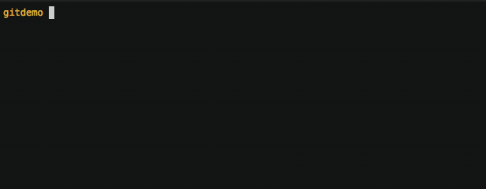
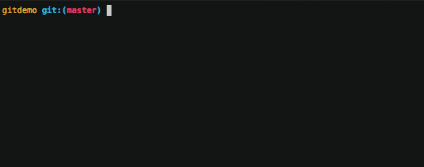
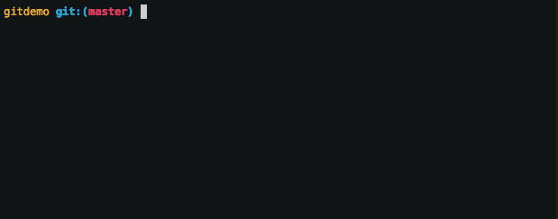
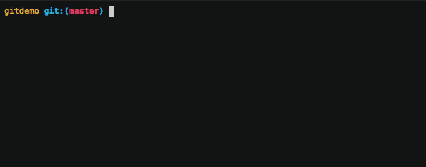
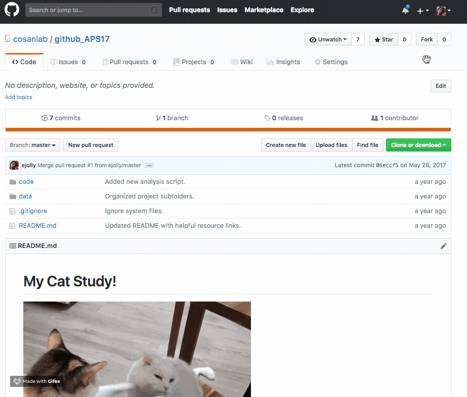

# Intro to Git/Github

The following slides provide a high-level conceptual overview of git and github using the analogy of a social time-machine.

<embed src="https://www.dropbox.com/scl/fi/rijpa5nimd715kffp349a/git_github_slides.pdf?rlkey=sn8kfza51ogns1qnarmvp7e2z&dl=0" width="100%" height="600px" />

## Quick Reference

## `git status`  
See what files are ready to be made into a "snapshot" (committed) and which ones are not being kept track of  
  

## `git init`  
Create a new git repository for the first time (will not add any files)  
  

## `git add`  
Add file(s) to the list of files that should be made into a "snapshot" (committed)
  

## `git commit`  
Take a "snapshot" of all currently tracked project files. Files need to be "prepped" (staged) for commit using `git add` beforehand.    
  

## `git log`  
See the full historical timeline of the project  
  

## `git push`  
Send latest local changes to a remote location (e.g. github)  
  

## `git pull`  
Get the latest changes from a remote location (e.g. github)  
  

## `git clone`  
Duplicate a remote repository (e.g. github) on your local computer  

## `git branch`  
Create a new independent "timeline" for the project  
  

## `git revert`  
Undo changes by reversing any specific "snapshot" (commit)  
  

## `forking`  
Copy a remote repository on github, to your own remote account on github  
  

## `pull request`  
Notify a remote repository owner you would like them to review+incorporate your additions  
