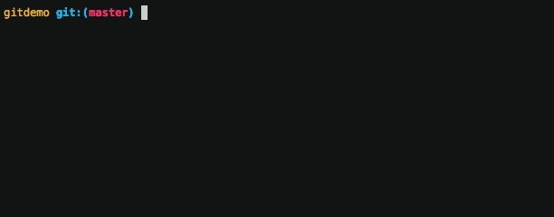

# Git & Github Cheatsheet

## (Optional) refresher
In this course we'll assume that you're at least somewhat familiar with git and github. If not you can toggle the drop-down below for a slide-deck that provides a high-level conceptual overview of version control using the analogy of a "social time-machine."

```{admonition} Git & Github Slides
:class: dropdown
<embed src="/pdfs/git_github_slides.pdf" width="100%" height="600px" />
```

## Most common commands

Rather than spend time on nitty-gritty details of git, we're providing a list of the most common commands you'll use in class (and in your day-to-day work!). 

### `git status`  
See what files are ready to be made into a "snapshot" (committed) and which ones are not being kept track of  
  

### `git add`  
Add/ready file(s) to the list of files that should be made into a "snapshot" (committed)
  

### `git reset`
Remove/unready file(s) from the list of files that should be made into a "snapshot" (committed).  
This doesn't remove/delete file(s) just removes them from the file you plan to include in this commit.

### `git commit`  
Take a "snapshot" of all currently tracked project files. Files need to be "prepped" (staged) for commit using `git add` beforehand. You'll almost always use the `-m 'some commit message'` flag when running this command. These messages will then appear in the `git log`!    
  

### `git log`  
See the full historical timeline of the project  
  

### `git init`  
Create a new git repository for the first time (will not add any files)  
  

## Commands/operations that work with github

The following commands communicate between your local computer's `git` repository and a remote github repository.

### `git clone`  
Duplicate a remote repository (e.g. github) on your local computer  


### `git push`  
Send latest local changes to a remote location (e.g. github). You'll run this command after you've performed a `git commit`    
  

### `git pull`  
Get the latest changes from a remote location (e.g. github)  
  

### `forking`  
Copy a remote repository on github, to your own remote account on github. This isn't a command per se, but a way to create a copy of another project on Github that you can then clone to your own computer. This is useful when you want to work on your own independent copy of another project, while still being able to suggest changes to the original project owner via a pull request.  
  

### `pull request`  
Notify a github (remote) repository owner you would like them to review+incorporate your commits. You can make a PR against a repository you own or one that someone else owns. PRs are the predominant way that you can collaborate and integrate changes between group members on github.    


## More advanced git

We won't necessarily be making much of use of the following commands in class, but they're useful to know about for your own projects.

### `git branch`  
Create a new independent "timeline" for the project. This is the "true power" of git, where you can create a totally independent copy of your project from any point in time (i.e. any commit), without affecting the original project. Branches can be useful for working on different features/ideas/etc or even collaborating with other people.  
  

### `git revert`  
Undo changes by reversing any specific "snapshot" (commit). Think of this is a "rollbaack" command that adds an entry to your project timeline. In other words, in addition to "undoing" a previous commit, we *also* keep a record of this "undo" using another commit.  
  
